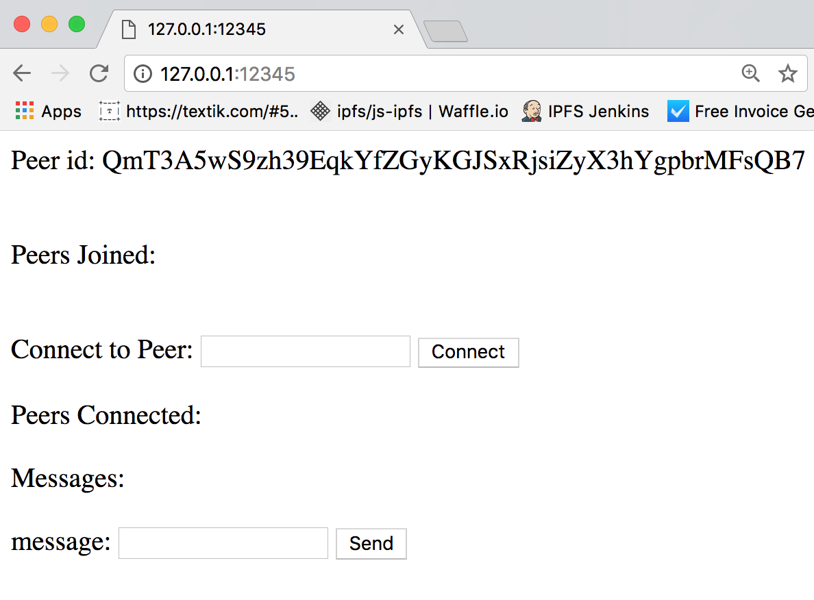
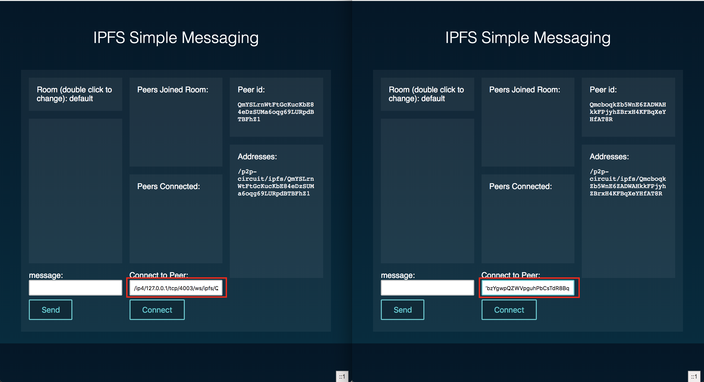
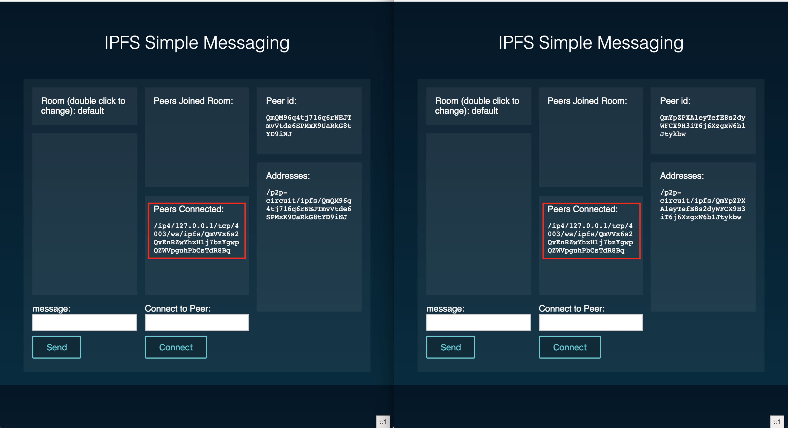

# Tutorial - Understanding Circuit Relay

> Welcome! This tutorial will help you understand circuit relay, where it fits in the stack and how to use it.

### So what is a `circuit-relay` and what do we need it for?

In p2p networks there are many cases where two nodes can't talk to each other directly. That may happen because of network topology, i.e. NATs, or execution environments - for example browser nodes can't connect to each other directly because they lack any sort of socket functionality and relaying on specialized rendezvous nodes introduces an undesirable centralization point to the network. A `circuit-relay` is a way to solve this problem - it is a node that allows two other nodes that can't otherwise talk to each other, use a third node, a relay to do so.

#### How does circuit relay work?

>for a more in-depth explanation take a look at the [relay spec](https://github.com/libp2p/specs/blob/master/relay/README.md) and `js-libp2p-circuit` [README](https://github.com/libp2p/js-libp2p-circuit/blob/master/README.md)

Here is a simple diagram depicting how a typical circuit-relay connection might look:

```
+---------------------+         |          |         +---------------------+
|       Node A        |---------> FIREWALL <---------|        Node B       |
+----------^----------+         |          |         +----------^----------+
           |                                                    |           
           |               +---------------------+              |           
           +--------------->   Circuit Relay     <--------------+           
                           +---------------------+                          
```

`Node A` tries to connect to `Node B` but, UH-OH! There is a firewall in between that's preventing it from happening. If both `Node A` and `Node B` know about a relay, they can use it to establish the connection. 

This is what it looks like, in simplified steps:

1. `Node A` tries to connect to `Node B` over one of its known addresses
2. Connection fails because of firewall/NAT/incompatible transports/etc...
3. Both `Node A` and `Node B` know of the same relay - `Relay`
4. `Node A` falls back to dialing over `Relay` to `Node B` using its `'/p2p-circuit'` address, which involves:
   1. `Node A` sends a `HOP` request to `Relay`
   2. `Relay` extracts the destination address, figures out that a circuit to `Node B` is being requested
   3. `Relay` sends a `STOP` request to `Node B`
   4. `Node B` responds with a `SUCCESS` message
   5. `Relay` proceed to create a circuit over the two nodes
5. `Node A` and `Node B` are now connected over `Relay`

That's it!

#### What's up with this `HOP` and `STOP` nonsense?

Circuit relay consists of two logical parts — dialer/listener and relay (`HOP`). The listener is also known as the `STOP` node. Each of these — dial, listen, and relay — happen on a different node. If we use the nodes from the above example, it looks something like this:

- The `dialer` knows how to dial a `relay` (`HOP`) - `Node A`
- The `relay` (`HOP`) knows how to contact a destination node (`STOP`) and create a circuit - `Relay` node
- The `listener` (`STOP`) knows how to process relay requests that come from the relay (`HOP`) node - `Node B`

_Fun fact - the `HOP` and `STOP` names are also used internally by circuit to identify the network message types._

#### A few caveats (and features)

There are a couple of caveats and features to be aware of:

- A `Relay` will only work if it already has a connection to the `STOP` node
- No `multihop` dialing is supported. It's a feature planed for upcoming releases (no date on this one)
  - `multihop` dialing is when several relays are used to establish the connection
- It is possible to use explicit relay addresses to connect to a node, or even to listen for connections on. See next section to learn how to do this.

#### A word on circuit relay addresses

A circuit relay address is a [multiaddress](https://multiformats.io/multiaddr/) that describes how to either connect to a peer over a relay (or relays), or allow a peer to announce it is reachable over a particular relay or any relay it is already connected to. 

Circuit relay addresses are very flexible and can describe many different aspects of how to esablish the relayed connection. In its simplest form, it looks something like this:

- `/p2p-circuit/ipfs/QmPerr`

If we want to be specific as to which transport we want to use to establish the relay, we can encode that in the address as well:

- `/ip4/127.0.0.1/tcp/65000/ipfs/QmRelay/p2p-circuit/ipfs/QmPeer`

This tells us that we want to use `QmRelay` located at address 127.0.0.1 and port 65000.

- `/ip4/127.0.0.1/tcp/65000/ipfs/QmRelay/p2p-circuit/ip4/127.0.0.1/tcp/8080/ws/ipfs/QmPeer`

We can take it a step further and encode the same information for the destination peer. In this case, we have it located at 127.0.0.1 on port 8080 and using a Web sockets transport!

- `/ip4/127.0.0.1/tcp/65000/ipfs/QmRelay/p2p-circuit`

If a node is configured with this address, it will use the specified host (`/ip4/127.0.0.1/tcp/65000/ipfs/QmRelay`) as a relay and it will be reachable over this relay. 
  - There could multiple addresses of this sort specified in the config, in which case the node will be reachable over all of them. 
  - This is useful if, for example, the node is behind a firewall but wants to be reachable from the outside over a specific relay.

Other use-cases are also supported by this scheme, e.g. we can have multiple hops (circuit-relay nodes) encoded in the address, something planed for future releases.

## Step-by-step instructions

Here's what we are going to be doing, today:

1. Install and configure `go-ipfs` and `js-ipfs` nodes
2. Configure and run the js or go ipfs node
3. Configure and run the bundled example
4. Connect the two browser nodes to the circuit relay
5. Dial the two browser nodes using a `/p2p-circuit` address
6. Finally, send data from one browser using the bundled example!

> We should end up with something similar to the bellow screenshot after we've gone through all the steps:


Let's go.

### 1. Set up

You'll need to have an implementation of IPFS running on your machine. Currently, this means either go-ipfs or js-ipfs.

Installing go-ipfs can be done by installing the binary [here](https://ipfs.io/ipns/dist.ipfs.io/#go-ipfs). Alternatively, you could follow the instructions in the README at [ipfs/go-ipfs](https://github.com/ipfs/go-ipfs).

Installing js-ipfs requires you to have node and [npm](https://www.npmjs.com). Then, you simply run:

```sh
> npm install --global ipfs
...
> jsipfs --help
Commands:
...
```

This will alias `jsipfs` on your machine; this is to avoid issues with `go-ipfs` being called `ipfs`.

At this point, you have either js-ipfs or go-ipfs running. Now, initialize it:

```sh
> ipfs init
# or
> jsipfs init
```

This will set up your IPFS repo in your home directory.

#### Configure and run the js or go ipfs node

You can use a `go-ipfs` or a `js-ipfs` node as a relay. We'll demonstrate how to set both up in this tutorial and we encourage you to try both out. That said, either js or go should do the trick!

##### Setting up a `go-ipfs` node

In order to enable the relay functionality in `go-ipfs` we need to edit it's configuration file, located under `~/.ipfs/config`:

```js
  "Swarm": {
    "AddrFilters": null,
    "ConnMgr": {
      "GracePeriod": "20s",
      "HighWater": 900,
      "LowWater": 600,
      "Type": "basic"
    },
    "DisableBandwidthMetrics": false,
    "DisableNatPortMap": false,
    "DisableRelay": false,
    "EnableRelayHop": true
  }
```

The two options we're looking for are `DisableRelay` and `EnableRelayHop`. We want the former (`DisableRelay`) set to `false` and the latter (`EnableRelayHop`) to `true`, just like in the example above. That should set our go node as a relay. 

We also need to make sure our go node can be dialed from the browser. For that, we need to enable a transport that both the browser and the go node can communicate over. We will use the web sockets transport, although there are others that can be used, such as `webrtc-star` and `websocket-star`. To enable the transport and set the interface and port we need to edit the `~/.ipfs/config` one more time. Let's find the `Swarm` array and add our desired address there. I picked `/ip4/0.0.0.0/tcp/4004/ws` because it is a port I know is not being used by anything on my machine, but we can also use port `0` so that the OS chooses a random available port for us — either one should work.

```
  "Swarm": [
    "/ip4/0.0.0.0/tcp/4001",
    "/ip4/0.0.0.0/tcp/4004/ws",
    "/ip6/::/tcp/4001"
  ],
```

The config should look similar to the above snippet after we've edited it.

##### Setting up a `js-ipfs` node

We need to go through similar steps to enable circuit relay in `jsipfs`. However, the config options are slightly different — that should change once this feature is not marked as experimental, but for now we have to deal with two different sets of options.

Just as we did with `go-ipfs`, go ahead and edit `js-ipfs` config file located under `~/.jsipfs/config`. Let's add the following config:

(Note that the "EXPERIMENTAL" section might be missing from the config file. In that case, just go ahead and add it)

```js
  "EXPERIMENTAL": {
    "relay": {
      "enabled": true,
      "hop": {
        "enabled": true
      }
    }
  }
```

Note that we don't have to do anything to enable the `websocket` transport as it is enabled by default in `jsipfs`.

##### Starting the relay node

We can start the relay nodes by either running `ipfs daemon` or `jsipfs daemon`:

**go ipfs**

```
$ ipfs daemon
Initializing daemon...
Swarm listening on /ip4/127.0.0.1/tcp/4001
Swarm listening on /ip4/192.168.1.132/tcp/4001
Swarm listening on /ip6/::1/tcp/4001
Swarm listening on /p2p-circuit/ipfs/QmY73BLYav2gYc9PCEnjQqbfSGiqFv3aMsRXNyKFGtUoGF
Swarm announcing /ip4/127.0.0.1/tcp/4001
Swarm announcing /ip4/186.4.18.182/tcp/58986
Swarm announcing /ip4/192.168.1.132/tcp/4001
Swarm announcing /ip6/::1/tcp/4001
API server listening on /ip4/127.0.0.1/tcp/5001
Gateway (readonly) server listening on /ip4/127.0.0.1/tcp/8080
Daemon is ready
```

In the case of go ipfs, the crucial `/ipfs/Qm...` part of the multiaddr might be missing. In that case, you can get it by running the `ipfs id` command.

```
$ ipfs id
{
        "ID": "QmY73BLYav2gYc9PCEnjQqbfSGiqFv3aMsRXNyKFGtUoGF",
        "PublicKey": "CAASpgIwggEiMA0GCSqGSIb3DQEBAQUAA4IBDwAwggEKAoIBAQC84qPFzqajCfnvaJunqt48S1LIBRthXV60q5QClL+dUfOOU/m7v1ZcpNhvFFUN6tVCDaoT5AxEv0czxZiVx/njl6FVIc6tE1J+HWpc8cbAXNY6QbbyzKl/rjp7V8/QClE0JqgjIk84wnWGTwFhOEt0hnpu2XFt9iHaenSfg3EAa8K9MlbxmbawuxNLJJf7VZXkJrUNl6WOglAVU8Sqc4QaahCLVK5Dzo98zDBq1KDBxMbUgH0LTqzr6i+saxkEHZmBKO+mMVT3LzOUx1DQR4pLAw1qgoJstsIZEaJ2XLh975IiI7OKqWYH7+3NyNK2sldJK/4Zko4rH3irmnkAxLcFAgMBAAE=",
        "Addresses": [
                "/ip4/127.0.0.1/tcp/4001/ipfs/QmY73BLYav2gYc9PCEnjQqbfSGiqFv3aMsRXNyKFGtUoGF",
                "/ip4/192.168.1.132/tcp/4001/ipfs/QmY73BLYav2gYc9PCEnjQqbfSGiqFv3aMsRXNyKFGtUoGF",
                "/ip6/::1/tcp/4001/ipfs/QmY73BLYav2gYc9PCEnjQqbfSGiqFv3aMsRXNyKFGtUoGF",
                "/ip4/186.4.18.182/tcp/13285/ipfs/QmY73BLYav2gYc9PCEnjQqbfSGiqFv3aMsRXNyKFGtUoGF",
                "/ip4/186.4.18.182/tcp/13285/ipfs/QmY73BLYav2gYc9PCEnjQqbfSGiqFv3aMsRXNyKFGtUoGF"
        ],
        "AgentVersion": "go-ipfs/0.4.14-dev/cb5bb7dd8",
        "ProtocolVersion": "ipfs/0.1.0"
}
```

We can then grab the resolved multiaddr from the `Addresses` array — `/ip4/127.0.0.1/tcp/4004/ws/ipfs/Qm...`. Let's note it down somewhere and move to the next step.

**js ipfs**

```
$ jsipfs daemon
Initializing daemon...
Swarm listening on /p2p-circuit/ipfs/QmfQj8YwDdy1uP2DpZBa7k38rSGPvhHiC52cdAGWBqoVpq
Swarm listening on /p2p-circuit/ip4/0.0.0.0/tcp/4002/ipfs/QmfQj8YwDdy1uP2DpZBa7k38rSGPvhHiC52cdAGWBqoVpq
Swarm listening on /p2p-circuit/ip4/127.0.0.1/tcp/4003/ws/ipfs/QmfQj8YwDdy1uP2DpZBa7k38rSGPvhHiC52cdAGWBqoVpq
Swarm listening on /ip4/127.0.0.1/tcp/4003/ws/ipfs/QmfQj8YwDdy1uP2DpZBa7k38rSGPvhHiC52cdAGWBqoVpq
Swarm listening on /ip4/127.0.0.1/tcp/4002/ipfs/QmfQj8YwDdy1uP2DpZBa7k38rSGPvhHiC52cdAGWBqoVpq
Swarm listening on /ip4/192.168.1.132/tcp/4002/ipfs/QmfQj8YwDdy1uP2DpZBa7k38rSGPvhHiC52cdAGWBqoVpq
API is listening on: /ip4/127.0.0.1/tcp/5002
Gateway (readonly) is listening on: /ip4/127.0.0.1/tcp/9090
Daemon is ready
```

Look out for an address similar to `/ip4/127.0.0.1/tcp/4003/ws/ipfs/Qm...`. Note it down somewhere, and let's move on to the next step. 

### 2. Configure and run the bundled example

Now that we have ipfs installed and initialized, let's set up the included example. This is a standard npm package, so the usual `npm install` should get us going. Let's `cd` into the `examples/circuit-relaying` directory and run:

```
npm install
```

After it finishes, we should be able to run the project with `npm start` and get output similar to:

```
npm run start
Server running at http://localhost:1234
```

The bundled example is a simple chat app that uses another cool ipfs feature - [pubsub](https://github.com/libp2p/specs/tree/master/pubsub). Let's open up a browser and paste the above url into the address bar. We should see something similar to the following image:



### 3. Connect the two browser nodes to the circuit relay

In order for our browser nodes to be able to messages each other, we need to get them connected. But do do that, we need to use a relay - browser nodes can't be connected directly because of lack of socket support. 

Remember the caveat above `Currently a Relay will only work if it already has a connection to the STOP node`? This means that we need to connect our browser nodes to the relay node first.

Having both browsers running side by side (as shown in the first screenshot), enter the `/ip4/127.0.0.1/tcp/4003/ws/ipfs/...` address noted above into the `Connect to Peer` field and hit the `Connect` button:



After connecting to the IPFS node, we should see the relay peer show up under the `Peers Connected` box.



Let's repeat the same steps with the second tab. Now, both of our browser nodes should be connected to the relay and we can move on to the next step.

### 4. Dial the two browser nodes using a `/p2p-circuit` address

Now that both browsers are running side by side (as shown in the first screenshot), let's get them connected to each other. Head out to the `Addresses` box in one of the tabs, copy the `/p2p-circuit` address and then paste it into the `Connect to Peer` box in the other tab. Repeat these steps on the second tab.


Let's hit the `Connect` button on each of the tabs and we should get the two browsers connected and join the chat room.


### 5. Send data browser to browser.

Now that we have the two browsers connected, let's try the app out. Type a few words in one of the browser windows and you should see them appear in the other as well!


Thats it!

### So what just happened?

Good question! 

- We used [js-ipfs](htpps://github.com/ipfs/js-ipfs) running in the browser with circuit relay enabled:
  - _Notice the `EXPERIMENTAL.relay.enabled` below_

you can find it in [src/app.js](src/app.js)
```js
const ipfs = new IPFS({
  repo: repo(),
  EXPERIMENTAL: {
    relay: {
      enabled: true,
      hop: {
        enabled: true
      }
    }
  },
  config: {
    Bootstrap: []
  }
})
```

- We connected the browser nodes to an external node over its websocket transport using the `/ip4/127.0.0.1/tcp/4003/ws/ipfs/...` multiaddr. That external node happens to be `HOP` node, meaning that it can relay connections for our browsers (and other nodes) allowing them to connect

- And finally we connected the two browser nodes using the `/p2p-circuit/ipfs/...` multiaddr. Take a look at the code below in [src/app.js](src/app.js), lines 102-107

```js
    ipfs.swarm.connect(peer, (err) => {
      if (err) {
        return console.error(err)
      }
      $pAddrs.innerHTML += `<li>${peer.trim()}</li>`
    })
```

Notice how there wasn't anything special we had to do to use the circuit once we had everything connected, all the magic is in the multiaddr! Multiaddrs are **AWESOME**!

I encourage the reader to take a look at the bundled app code to see how the browser nodes get setup, suffice to say nothing changes from the perspective of using an `IPFS` node in js code, apart from the new `EXPERIMENTAL` options.

Finally, a side note on [pubsub](https://github.com/libp2p/specs/blob/master/pubsub/README.md). We've used the amazing [ipfs-pubsub-room](https://github.com/ipfs-shipyard/ipfs-pubsub-room) module, to enable the chat functionality. Make sure to take a look at the demo [video](https://www.youtube.com/watch?v=Nv_Teb--1zg) that explains how pubsub works and how it can be used to build other applications!

Cheers!
